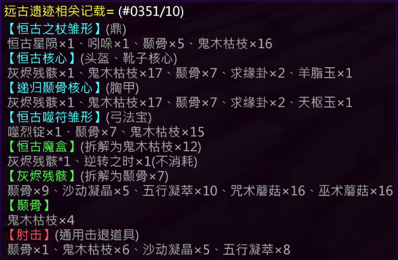

## 基础信息

| 项目 | 详情 |
|:---:|---|
| **副本入口** | 神树幻境 |
| **副本前置** | 无 |

---

## 结算奖励

### 通用结算奖励
- 鬼木枯枝 × 1
- 银票 × 6
- 奇诡的字符 × 3
- 金苹果 × 2

### 特殊结算奖励（概率掉落）

| 奖励内容 | 概率 |
|---|---|
| 团队抽奖卷 × 1、个人抽奖卷 × 1 | 4.3% |
| 个人抽奖卷 × 1 | 8.1% |
| 鬼木枯枝 × 2 | 50% |
| 空 | 37.6% |
| [炼丹师] 五行元素核 × 6 | **100%** |

---

## 副本机制

### 全局设定

**两种敌对单位**：
1. **护卫**：不可被攻击、超高移速、超高伤害
2. **闪电苦力怕**：不断刷新的大量单位

**场地布局**：
- 包含 **5个通道**
- 每个通道尽头设有 **金砖** 和 **通道核心**
- 副本内设有 **黑屋**，内有 **5盏编号为1-5的灯**，对应场地5个通道核心

---

### 每轮流程

#### 1. 传送与信息传递

- 每轮开始时，随机选取 **1名玩家** 传送至黑屋（单人模式除外）
- 该玩家在本轮未完成前 **不可离开黑屋**
- 黑屋内随机亮起 **2盏灯** → 对应本轮需击杀的通道核心编号
- 进入黑屋的玩家需 **迅速将亮灯数字告知** 场地内其他玩家

#### 2. 击杀核心

- 其余玩家需在 **极短时间内** 击杀对应的 **2个通道核心**
- ❌ 若杀错核心 或 未在限时内完成 → **全体死亡，游戏结束**

#### 3. 推猪人

- 成功击杀对应核心后，其余通道核心进入 **不可攻击状态**
- 场地中心刷新 **1只不可移动的猪人**（守护核心）
- 需将猪人 **推至5个通道中任意一个通道的尽头金砖处**
- ✅ 完成此操作即顺利通过本轮

---

### 轮次与通关

- 共 **5轮**
- 顺利通过全部5轮 → ✅ 副本通关

---

### 特殊机制

#### 单人模式
- 被传送至黑屋后，可 **自由离开黑屋** 以击杀通道核心

#### 护卫脱战技巧
- 引诱护卫进入通道金砖区域
- 随后 **手持羽毛快速前往另一个房间**
- 可使护卫 **失去索敌**

---

## 装备产出

### [恒古之杖](/equip/tripod/80_hanshuangyin)（炼丹师）

### [恒古陵冠](/equip/helmet/19_henggulingguan)（头盔）

### [递归颧骨](/equip/chestplate/19_diguiniegu)（铠甲）

### [恒古霆锋](/equip/boots/16_henggutingfeng)（鞋子）

### [恒古噬咒](/equip/treasured/archers/henggushifu)（法宝 · 弓箭手）

---

## 锻造配方

