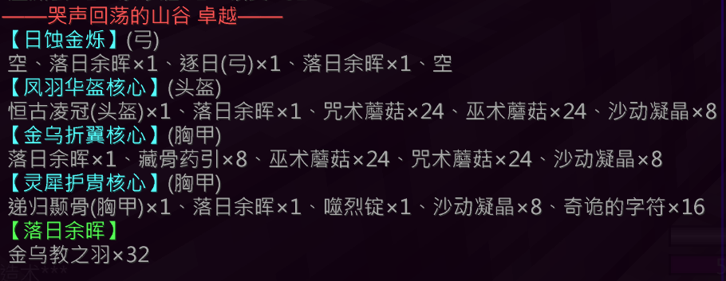

## 基础信息

| 项目 | 详情 |
|:---:|---|
| **副本入口** | 第一大陆哭谷 |
| **副本前置** | 同普通哭谷 |

---

## 结算奖励

### 通用结算奖励
- 沉重元素 × 50
- 灵魂 × 1500

### 特殊结算奖励（概率掉落）

| 奖励内容 | 概率 |
|---|---|
| 银票 × 6 | 25% |
| 银票 × 4 | 25% |
| 银票 × 2 | 37.5% |
| 银票 × 1 | 12.5% |
| [炼丹师] 五行元素核 × 6 | **100%** |

---

## 副本机制

### 核心机制

- 妖鸟每次受到攻击时，会落下一只 **蠹虫**
  - 该蠹虫拥有 **超高移速** 和 **超高伤害**
  - 若一段时间内没有击杀该蠹虫，它会 **变成妖鸟**

> ⚠️ 需要及时清理蠹虫，避免其进化为妖鸟导致怪物数量失控

---

## 装备产出

### [日蚀金烁](/equip/bow/80_rishijinshuo)（弓）

### [凤羽华盔](/equip/helmet/23_fenglihairan)（头盔）

### [金乌折翼](/equip/chestplate/25_jinwuzheyi)（铠甲）

### [灵犀护胄](/equip/chestplate/26_lingxihuzhou)（铠甲）

---

## 锻造配方

