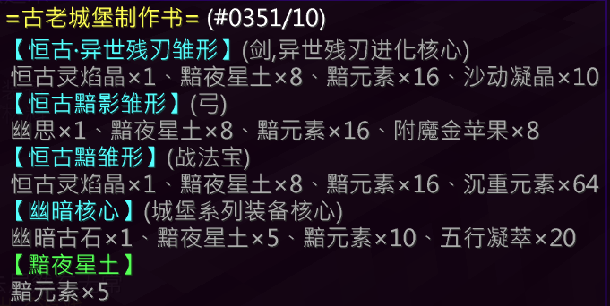

## 基础信息

| 项目 | 详情 |
|:---:|---|
| **副本入口** | 幻湖神树 |
| **副本前置** | 无 |

---

## 结算奖励

### 通用结算奖励
- 黯元素 × 2
- 奇诡的字符 × 5
- 银票 × 6
- 附魔金苹果 × 1

### 特殊结算奖励（概率掉落）

| 奖励内容 | 概率 |
|---|---|
| 个人抽奖卷 × 1 | 12.5% |
| 黯夜星土 × 1、古老城堡制作书 × 1 | 12.5% |
| 五行凝翠 × 6、古老城堡制作书 × 1 | 25% |
| 黯元素 × 2 | 33.6% |
| 古老城堡制作书 × 1 | 16.3% |
| [炼丹师] 五行元素核 × 8 | **100%** |

---

## 副本机制

### 前几轮

- 不断召唤 **大量小怪**
- 策略：**杀杀杀**

---

### 最后一轮 · Boss 战

- **城堡主** 及其 **分身** 出现
- 同时 **封闭城堡外围**
- ⚠️ 在城堡外时会持续受到 **火焰伤害**

#### 城堡主机制

| 触发条件 | 效果 |
|---|---|
| 城堡主或分身死亡 | 将另一个的血量设置为 **48,000** |

#### 城堡主技能（周期性释放其一）

| 技能 | 效果 |
|---|---|
| **召唤小怪** | 召唤大量小怪 |
| **护法器携带者** | 选定一名玩家为携带者，**12秒** 后若未在其附近，将受到 **高额处决伤害** |
| **特殊护卫** | 召唤1只特殊护卫，若未在规定时间内击杀，全体玩家将受到 **高额处决伤害** |

---

## 装备产出

### [恒古·异世残刃](/equip/sword/90_dizangliange)（战士）

### [恒古黯影](/equip/bow/95_genguanying)（弓）

### [冥虹镜芒](equip/helmet/4_minghongjingmang)（头盔）

### [龙鳞铠甲](/equip/chestplate/25_longlinkaijia)（铠甲）

### [魔导之魂](/equip/leggings/26_modaozhihun)（裤子）

### [虚幻圆舞](/equip/boots/25_xuhuanyuanwu)（鞋子）

---

## 锻造配方

