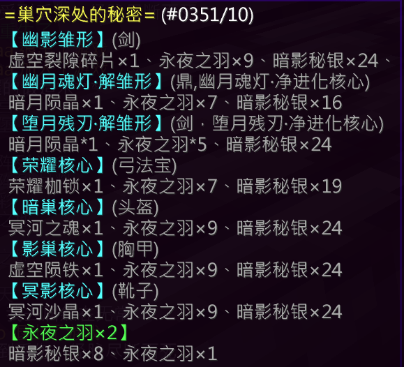

## 基础信息

| 项目 | 详情 |
|:---:|---|
| **副本入口** | 神树东，森林内（坐标：`5840, 68, -253`） |
| **副本前置** | 无 |

---

## 结算奖励

### 通用结算奖励
- 暗影秘银 × 2
- 银票 × 5
- 附魔金苹果 × 2
- 异世见闻 × 3

### 特殊结算奖励（概率掉落）

| 奖励内容 | 概率 |
|---|---|
| 永夜之羽 × 1 | 12.5% |
| 永夜之羽 × 2 | 7% |
| 暗影秘银 × 2 | 25% |
| 暗影秘银 × 3 | 12.5% |
| 暗影秘银 × 4 | 11.2% |
| 空 | 44.4% |
| [炼丹师] 五行元素核 × 9 | **100%** |

---

## 副本机制

（待补充）

---

## 装备产出

### [幽影裂空剑](/equip/sword/90_youyingliekongjian)（战士）

### [幽月魂灯·净](/equip/tripod/95_youyuehundengjing)（炼丹师）

### [黯巢冥盔](/equip/helmet/25_anchaomingkui)（头盔）

### [影巢魂护](/equip/chestplate/24_yingchaohunhu)（铠甲）

### [冥影步靴](/equip/boots/26_mingyingbuxue)（鞋子）

### [荣耀暗面](/equip/treasured/archers/rongyaoanmian)（法宝 · 弓箭手）

---

## 锻造配方

