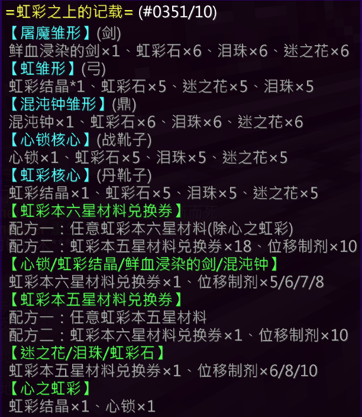

## 基础信息

| 项目 | 详情 |
|:---:|---|
| **副本入口** | 神树幻境，彩虹池 |
| **副本前置** | TNTRUN 小游戏（单人可支付 32p 跳过，多人可直接跳过） |

---

## 结算奖励

### 通用结算奖励
- 银票 × 7
- 附魔金苹果 × 8
- 虹彩本五星材料兑换券 × 2
- 异世见闻 × 9
- 奇诡字符 × 6
- 五行浓缩元素 × 12
- 功勋 × 100

### 特殊结算奖励（概率掉落）

| 奖励内容 | 概率 |
|---|---|
| 虹彩六星兑换卷 × 1（三阶完成） | 6.5% |
| 虹彩六星兑换卷 × 1（二阶完成） | 1% |
| 银票 × 6 | 60.3% |
| 空 | 33.2% – 38.7% |
| [炼丹师] 五行浓缩元素核 × 1 | **100%** |

---

## 副本机制

> 📝 副本准备房内有详尽介绍，请于游戏内查阅。

（详细机制待补充）

---

## 装备产出

### [屠魔](/equip/sword/100_tumo)（战士）

> 屠戮·壹、屠戮·贰 需使用升格强化 **屠魔** 后解锁

### [虹](/equip/bow/110_hong)（弓）

### [混沌钟](/equip/tripod/117_hundunzhong)（炼丹师）

### [心之锁](/equip/boots/27_xinzhisuo)（鞋子）

### [虹彩鞋](/equip/boots/30_hongcaixue)（鞋子）

---

## 锻造配方

