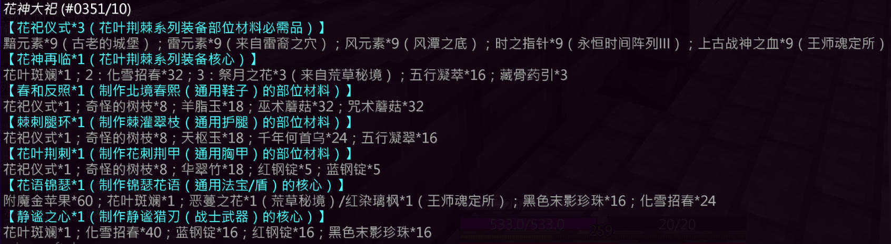

## 基础信息

| 项目 | 详情                         |
|:---:|----------------------------|
| **副本入口** | 新月城                        |
| **副本前置** | 跑酷 / 刷怪 二选一（推荐跑酷，可用末影珍珠逃课） |

---

## 结算奖励

### 通用结算奖励
- 化雪招春 × 2
- 五行浓缩元素核 × 1
- 银票 × 5

### 特殊结算奖励（概率掉落）

| 奖励内容        | 概率    |
|-------------|-------|
| 花叶斑斓 × 1 | 2.5%  |
| 藏骨药引 × 2    | 97.5% |

---

## 副本机制

> 📝 **最新副本，请自行探索**

---

## 装备产出

### [静谧猎刃](/equip/sword/115_jingmilieren)（剑）
### [花刺荆甲](/equip/chestplate/37_huacijingjia)（胸甲）
### [棘灌翠枝](/equip/leggings/37_jiguancuizhi)（护腿）
### [北境春熙](/equip/boots/37_beijingchunxi)（鞋子）
### [锦瑟花语](/equip/shield/common/jinsehuayu)（通用盾）

---

## 锻造配方

