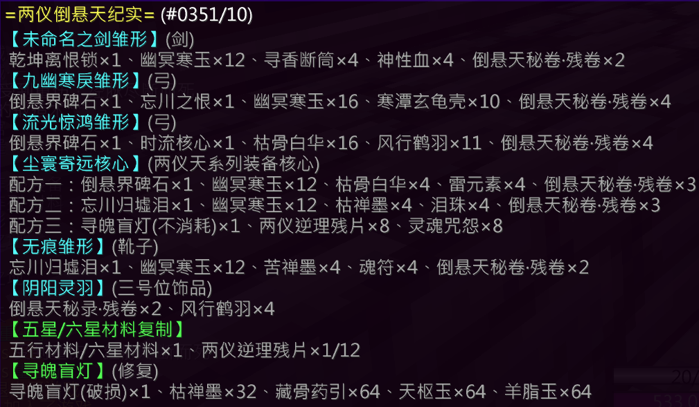

## 基础信息

| 项目 | 详情 |
|:---:|---|
| **副本入口** | 神树幻境 |
| **副本前置** | 主线任务解锁至神树幻境 |

---

## 结算奖励

### 通用结算奖励
- 两仪逆理残片 × 2

### 特殊结算奖励（概率掉落）

（待补充）

---

## 副本机制

> 📝 **最新副本，请自行探索**

> ⚠️ 本副本由于特殊原因无期限关闭

---

## 装备产出

### [天地同悲](/equip/sword/120_tianditongbei)（剑）
### [九幽寒戾](/equip/bow/120_jiuyouhanli)（弓）
### [流光惊鸿](/equip/bow/120_liuguangjinghong)（弓）
### [南望桂水](/equip/helmet/31_nanwangguishui)（头）
### [北顾苍梧](/equip/chestplate/31_beigucangwu)（护甲）
### [逆风衔羽](/equip/leggings/37_nifengxianyu)（护腿）
### [步履长虹](/equip/boots/38_bulvchanghong)（鞋子）
### [踏雪无痕](/equip/boots/33_taxuewuhen)（鞋子）

---

## 锻造配方

