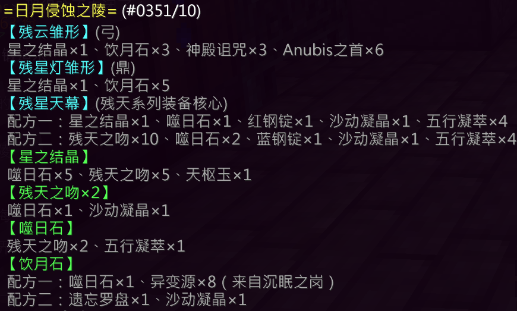

## 基础信息

| 项目 | 详情 |
|:---:|---|
| **副本入口** | 热砂围东（坐标：`-4539, 82, -259`） |
| **副本前置** | 陵墓入口附近会刷新小怪 **地狩**（240 HP），该小怪掉落 **命筹** |

---

## 结算奖励

### 通用结算奖励
- 残天之吻 × 1
- 沙动凝晶 × 1
- 银票 × 5
- 五行元素 × 64

### 特殊结算奖励（概率掉落）

| 奖励内容 | 概率 |
|---|---|
| 残天之吻 × 2、藏骨药引 × 1 | 12.5% |
| 沙动凝晶 × 1 | 12.5% |
| 藏骨药引 × 1 | 12.5% |
| 华翠竹 × 1 | 25% |
| 空 | 37.5% |
| [炼丹师] 五行元素核 × 2 | **100%** |

---

## 副本机制

### 阶段一

你需要通过 **七色云间** 和 **血肉盘山** 中的 **任意一个** 以进入下一阶段。

> 📝 **注**：进入 **七色云间** 可习得 **噬日饮月之陵** 锻造配方。

---

#### 七色云间（心跳水立方）

- 按照 **红 → 橙 → 黄 → 绿 → 灰 → 蓝 → 紫** 的顺序依次跳至对应平台
- 总共 **7次**
- ❌ 失败即死
- 消耗 **命筹** 可复活：
  - 前两次复活 **不消耗** 命筹
- 可消耗 **10个命筹** 直接跳过此关

---

#### 血肉盘山（螺旋绕圈爬山）

- 高度 > 20 时获得 **饥饿** 负面效果
- 会刷新骑着 **王陵的蕴气**（185 HP）的 **王陵的守望者**（200 HP）
- ⚠️ 王陵的守望者具有 **击退** 能力，注意躲避攻击

---

### Boss房

#### 每轮机制

- 每轮召唤：
  - 王座近卫 × 4（500 HP）
  - 王座火器 × 2（500 HP）
  - 王座射手 × 2（500 HP）
- 全部击杀后进入下一轮
- 📈 每多一名玩家，怪物血量增加 **250点**

#### 第四轮 · BOSS登场

- **王座之手**（1000 HP）从王座中冒出
- 拥有 **1000点护盾**
- 周期性召唤：
  - 王座沙虫（15 HP）
  - 王座护者（200 / 150 HP）
- ✅ 击杀 **王座之手** 即为通关

---

## 装备产出

### [残云](/equip/bow/60_cangqiong)（弓）

**风卷**：射箭时，吹飞位于你面前 **3格** 的怪物

### [残星灯](/equip/tripod/60_canxingdeng)（炼丹师）

**星陨**：攻击时，对亡灵 **额外造成 70点伤害**

### [卯时星焰](/equip/helmet/12_maoshixingyan)（头盔）

### [残天珞羽](/equip/chestplate/10_cantianluoyu)（铠甲）

### [星念罗衾](/equip/chestplate/12_xingluoluoqin)（裤子）

### [星帘下](/equip/boots/10_xinglianxia)（鞋子）

### [旧王室禀俸](/equip/treasured/common/jiuwangshibingfeng)（法宝 · 通用）

> 📍 新月锻造室 · 锻造方案商处兑换

---

## 锻造配方
