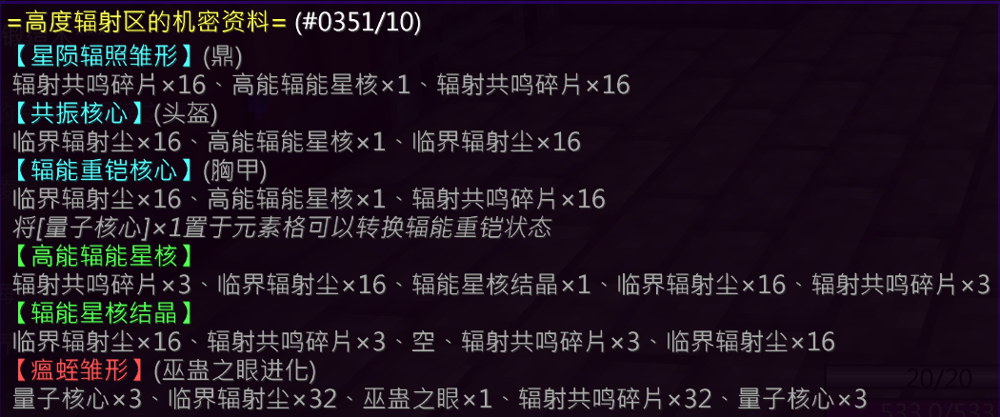

## 基础信息

| 项目 | 详情 |
|:---:|---|
| **副本入口** | 沉眠之岗北，辐能研究所（坐标：`5419, 76, -1005`） |
| **副本前置** | 无 |

---

## 结算奖励

### 通用结算奖励
- 辐射共鸣碎片 × 2
- 临界辐射尘 × 2
- 银票 × 5
- 人参 × 10
- 异世见闻 × 3

### 特殊结算奖励（概率掉落）

| 奖励内容 | 概率 |
|---|---|
| 辐射共鸣碎片 × 2 + 银票 × 2 | 25% |
| 辐射共鸣碎片 × 4 | 37.5% |
| 辐射共鸣碎片 × 4 + 辐射临界尘 × 2 | 12.5% |
| 空白 | 25% |
| [炼丹师] 五行元素核 × 6 | **100%** |

---

## 副本机制

### 核心玩法

你需要合理规划各种调节剂的使用数量和使用时间，达成所需发电量。最终得分取决于：
- 挑战人数
- 反应堆规模
- 反应时间

根据得分的不同，通关时获得不同的评级，评级将影响你的开箱奖励和特殊结算奖励。

| 评级 | 分数区间 |
|:---:|---|
| 及格 | 0 – 19,999 分 |
| 优秀 | 20,000+ 分 |
| 登神 | 50,000+ 分 |

### 基础参数

| 参数 | 阈值 |
|---|---|
| 电量需求 | 1000 点 |
| 核心温度 T | > 1000 → **失败** |
| 辐射功率 P | > 100 → **失败** |

---

### 怪物与掉落

> 每 **40秒** 刷新一轮怪物（上轮怪物不清空），击杀怪物可获得不同道具。

| 怪物 | 血量 | 数量 | 掉落制剂 | 基础效果 |
|---|---|---|---|---|
| 凋零骷髅 | 300 HP | 5 | 反应剂 | 提供 50 点发电量 |
| 苦力怕 | 100 HP | 2 | 催化剂 | 提高催化系数 |
| 僵尸 | 450 HP | 2 | 调节剂 | 降低催化系数 |
| 烈焰人 | 300 HP | 4 | 升温剂 | 核心温度 +30 |
| 洞穴蜘蛛 | 400 HP | 2 | 降温剂 | 核心温度 -30 |
| 猪人 | 100 HP | 2 | 辐射吸收剂 | 降低辐射功率 |

---

### 核心指标与公式

反应堆的运行受三大核心指标影响：**催化因子**、**温度因子**、**反应进度因子**。

#### 轮次得分 s

> *反应时间单位为秒，仅取决于反应速率*

---

#### 催化因子 F_catalysis

（公式待补充）

---

#### 温度因子 F_temperature

（公式待补充）

---

#### 随机因子 F_random

（公式待补充）

---

#### 反应进度因子 F_reaction

> 式中 P_done 为已产生电量，P_goal 为目标发电量

（公式待补充）

---

#### 反应速率 V

（公式待补充）

---

#### 发电功率 P_power

（公式待补充）

---

#### 实时温度 T

（公式待补充）

---

#### 辐射功率 P_radiant

（公式待补充）

---

### 环境机制

全场的火焰弹受到辐射影响，每秒对其 **4格** 范围内单位造成 **4点伤害**（包括烈焰人的火焰弹、火球术等）。

---

## 装备产出

### [星陨辐照](/equip/tripod/77_xingyunfuzhao)（炼丹师）

### [共振](/equip/helmet/16_gongzhen)（头盔）

### [辐能重铠](/equip/chestplate/20_funengzhongkaibilei)（铠甲）

## 锻造配方

