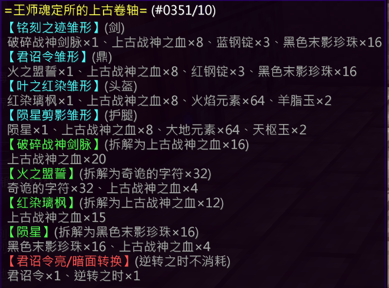

## 基础信息

| 项目 | 详情 |
|:---:|---|
| **副本入口** | 幻湖步行街 |
| **副本前置** | 主线任务解锁神树幻境 |

---

## 结算奖励

### 通用结算奖励
- 上古战神之血 × 1
- 大地元素 × 15
- 火焰元素 × 15
- 灵魂 × 800

### 特殊结算奖励（概率掉落）

| 奖励内容 | 概率 |
|---|---|
| 上古战神之血 × 2、银票 × 5 | 12.5% |
| 蓝钢锭 × 1、银票 × 5 | 12.5% |
| 银票 × 5 | 50% |
| 空 | 25% |
| [炼丹师] 五行元素核 × 3 | **100%** |

---

## 副本机制

> ⚠️ **请务必带好活络丸或末影珍珠**，这将极大提高你的副本体验。

---

### 第一前置 · 阵地占领

- 总共需要占领 **5处阵地**
- 阵地会不断被大量 **380 HP** 的敌人进攻
- 坚守 **70秒** 以占领阵地
- 5处阵地全部占领后继续前进

> 💡 可使用 **活络丸** 或 **末影珍珠** 逃课跑酷，在地图边缘可直接跳过去前往下一阵地。

---

### 第二前置 · 爬山与突破

1. **爬山**：爬一小段山路，推荐使用 **活络丸** 或 **末影珍珠** 过图
2. **突破守卫封锁**（蜘蛛网拦路 + 冲击弓小白），可使用 **末影珍珠** 辅助
3. 击杀 **太白金星** 及其护卫（太白金星会召唤护卫，护卫会为彼此提供护盾）

---

### Boss房 · 神族长老

> 提示："神族长老摘下七星之一" 为一轮，共 **6轮**

#### Boss 本体
- 类型：**高频瞬移、高移速、高伤害** 的末影人
- 机制：击破其护盾进入下一轮

> ⚠️ **一定要优先处理护卫凋零骷髅**！一旦数量叠起来将无法控制。

---

### Boss 技能（共3个）

#### 1. 不灭星辰之变

- 召唤若干 **护卫**（高防高血，低移速）
- 若再次释放时场上存在护卫，则复制其中 **至多5个**

#### 2. 星尘狂澜之变

- 召唤额外 **星尘**（白色粒子），并延长其存在时间
- 星尘特性：高移速、高伤害
- 💡 建议找个 **2格高** 的地方躲避

#### 3. 终焉灭辰之变

- Boss 进入短暂 **无敌时间**
- 场上玩家获得 **力量** 增益
- 护卫及星尘获得 **速度** 增益

---

## 装备产出

### [铭刻之迹](/equip/sword/80_mingkezhiji)（战士）

**战神剑意**：每 **10秒** 记录一次击砍伤害量，将它们按照 **击砍伤害量 ÷ 100** 转换为战斗强度（向上取整）

### [君诏令](/equip/tripod/80_junzhaoling)（炼丹师）

### [叶之红染](/equip/helmet/15_yezhihongran)（头盔）

### [陨星剪影](/equip/leggings/13_yunxingjianying)（裤子）

## 锻造配方

（待补充）