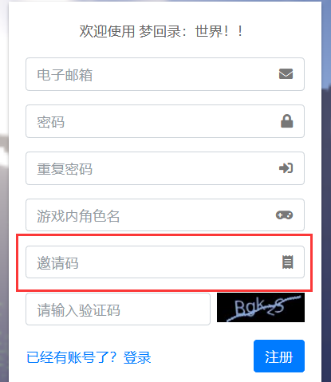
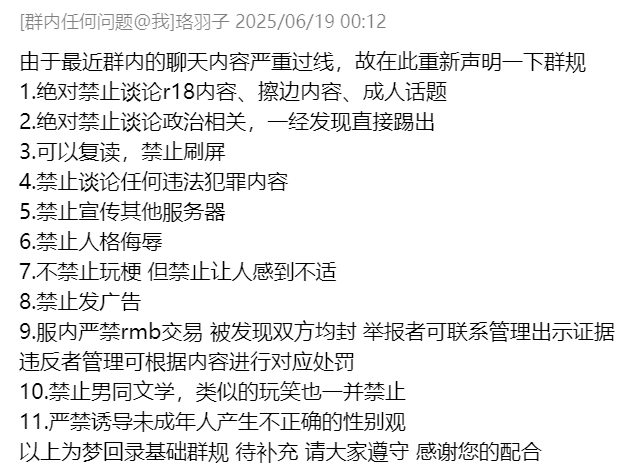
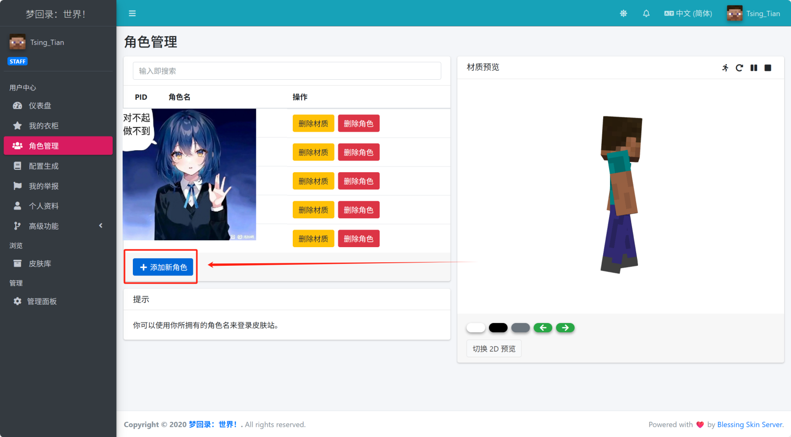
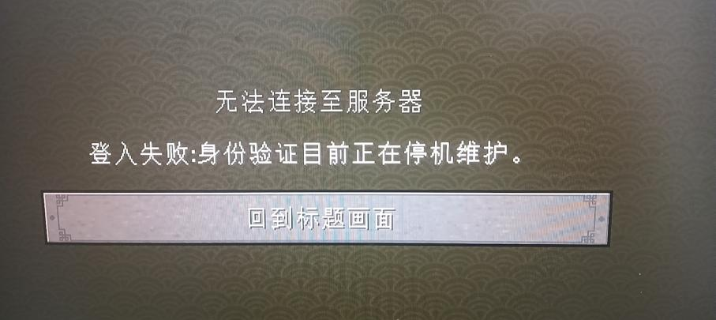
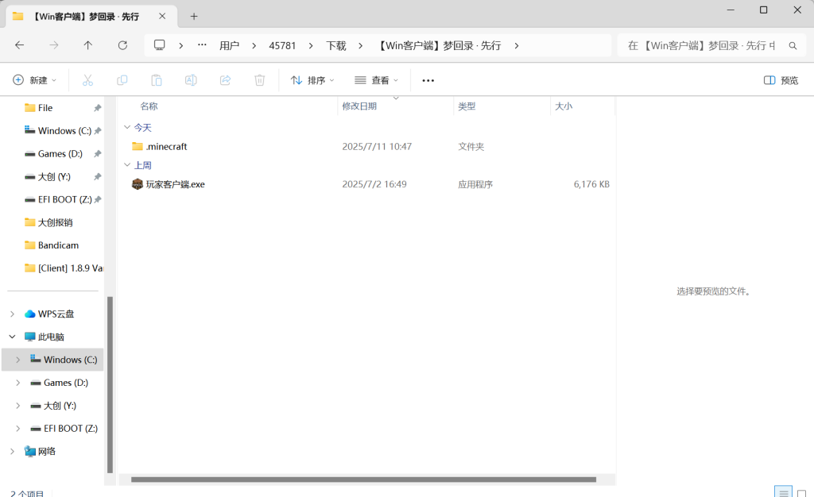
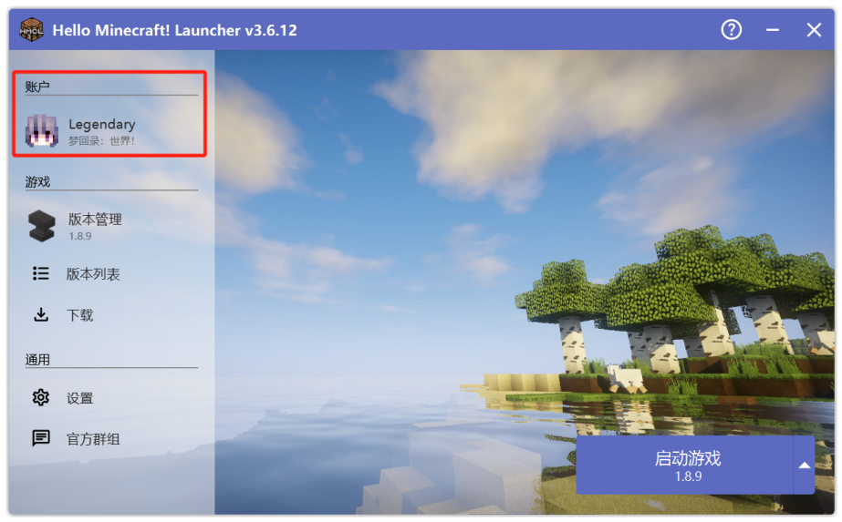
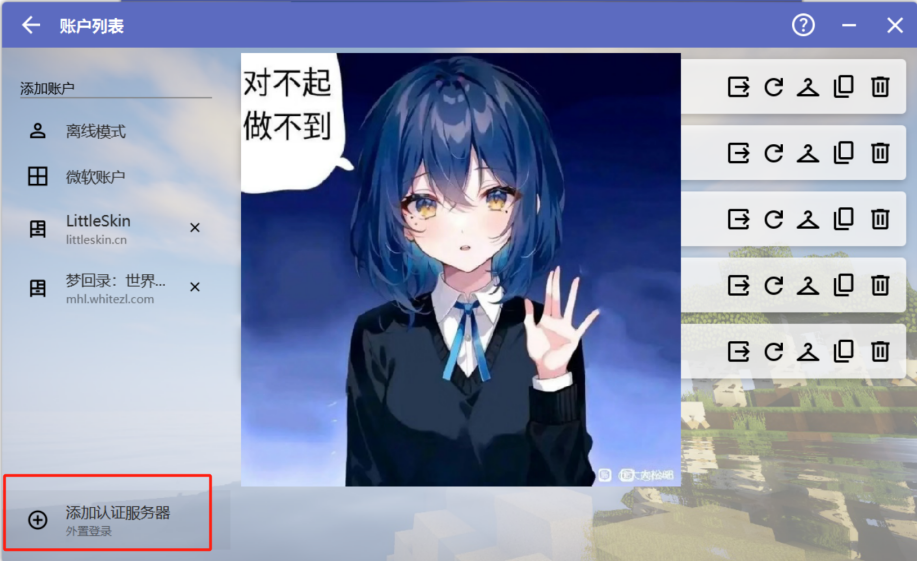
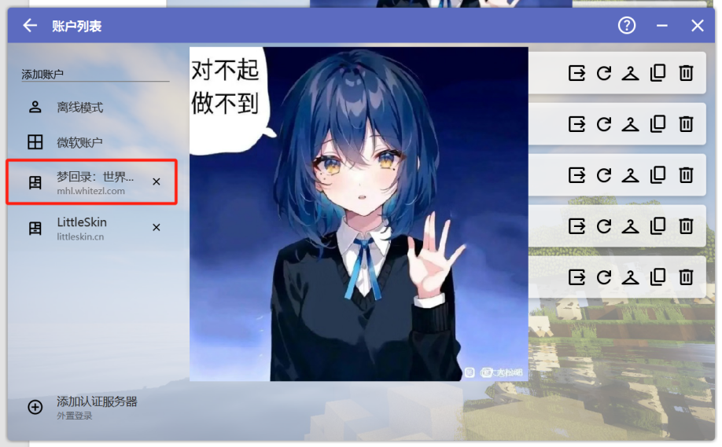
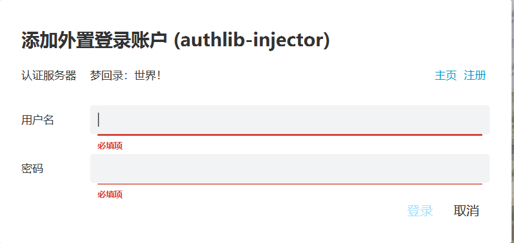

请按照以下步骤来进入服务器，
服务器IP见最新的公告

---

## 前言

- 请将游戏客户端的**丢弃键**设置到不易触发的位置，服务器不补偿任何因误操作导致的物品丢失。

 - 同时注意：1.8.X版本的服务端有点击物品显示消失的bug，出现此情况时不要慌张，物品实际上仍然存在，你可以当作其仍然在鼠标选择状态中，点击背包空位即可恢复。

---

## 一. 申请邀请码与账号注册

### 1、申请邀请码

皮肤站地址：**https://mhl.whitezl.com** 请在此注册账号。

邀请码请联系：

Dream_Origin
QQ：3125429327

请在群内向 Dream_Origin 发起 **QQ 临时会话**。

> 不要添加好友，请直接发送临时会话。

您需要满足以下条件：

1. 第一次在皮肤站进行注册。
2. 拥有一个等级达到 **一个太阳以上** 的 QQ 号，以证明不是小号。
3. 承诺不会在梦回录使用外挂、作弊客户端等第三方工具。

当您的审核通过，您将在3日内获得一份邀请码。我们会尽快为您生成一串专属的邀请码来帮助您完成注册操作。

邀请码功能于 2021 年 2 月 9 日 0 时 1 分 正式生效。 生效后： 所有注册皮肤站账号均需要审核获取邀请码。

当您违背了您“不在梦回录使用外挂、作弊客户端等第三方工具”的承诺后，我们有权封禁您的皮肤站账号和所有游戏角色，使得您无法继续登入梦回录游戏。

---

### 2、创建游戏角色
在皮肤站用户中心<角色管理>界面，添加新角色。

游戏 ID 要求：

- 总长度不超过 16 位；
- 只能包含：
  - 数字
  - 下划线 `_`
  - 英文字母

该 ID 即为游戏内显示名称。

---

## 二. 下载群内 Java8 与客户端

服务器只支持此方法登录，我们不建议你使用其他客户端和其他来源的Java

---

### 1、下载 Java8

建议使用群文件提供的 Java8。

原因：

- Java8 对 Minecraft 1.8.9 优化最佳；
- 部分 Java 版本无法通过梦回录登录验证。

#### Java 安装

解压群内 Java8 后：

运行： jre-8u202-windows-x64.exe 进行安装。

如果不了解如何修改启动器 Java 路径，请使用默认安装路径。

#### 使用其他 Java 可能出现的问题

使用其他渠道下载的java，可能出现此故障

---

### 2、下载客户端

下载群文件最新的客户端，解压。点击 **玩家客户端.exe** 来启动。

---

## 三. 登录皮肤站与进入服务器

点击 **玩家客户端.exe** 启动后，点击账户。

点击添加认证服务器，地址输入 **mhl.whitezl.com** ，成功识别后点击下一步。

点击认证的服务器，然后登录皮肤站账号（第一步注册的账号）

登陆成功后，即可进入服务器。
第一次进入服务器，可能需要补全文件，这一步会由启动器自行完成，耐心等待即可。

---

## 四. 常见问题

- 如果过了很久你的邀请码申请还是没有得到回复，请你检查一遍如下项目： 
  - 是不是自己没看到回复 
  - 是不是找错人了 
  - 私聊小窗是不是只发了“在吗” 
  - 是不是没满足一个太阳的要求 如果上述几条自查后没有问题，可以继续私聊群主或者是在群内联系管理员转告。
- 无法登录服务器的原因有以下几种 ：
  - 启动器登陆时无法登陆。请检查你是否验证了邮箱。 
  - 启动时提示下载某某库失败。请依序尝试以下三种解决办法：去mcbbs等地将HMCL更新至最新版。在HMCL的设置中更换一个下载源。切换成数据网络（流量）启动游戏。 
  - 服务器无法登入且提示无效的会话。请查看你是否是使用了外置登录，并请使用群文件中的Java启动游戏；关闭加速器，VPN等工具再启动游戏。 ④：服务器无法登入且提示Unknown Host。请检查你的IP是否正确，可关注服务器是否有IP变更。 
  - 皮肤站网页登不上去。请更换为谷歌浏览器或者火狐浏览器。
  - 提示邮箱不可以使用。请更换为QQ邮箱或者163邮箱。如果你是这两种邮箱以外的正版号，请私聊群主解决。
- 离线和正版玩家都不能直接进入梦回录服务器。正版可以通过在皮肤站使用与正版账号相同的邮箱注册来绑定正版号。由于直接使用正版号登录皮肤站可能发生各种不明原因的Bug，所以更推荐使用外置登录的方式进入。梦回录是一个公益的原版1.8.3盘灵古域服务器，进入服务器需要向群主索要邀请码。

